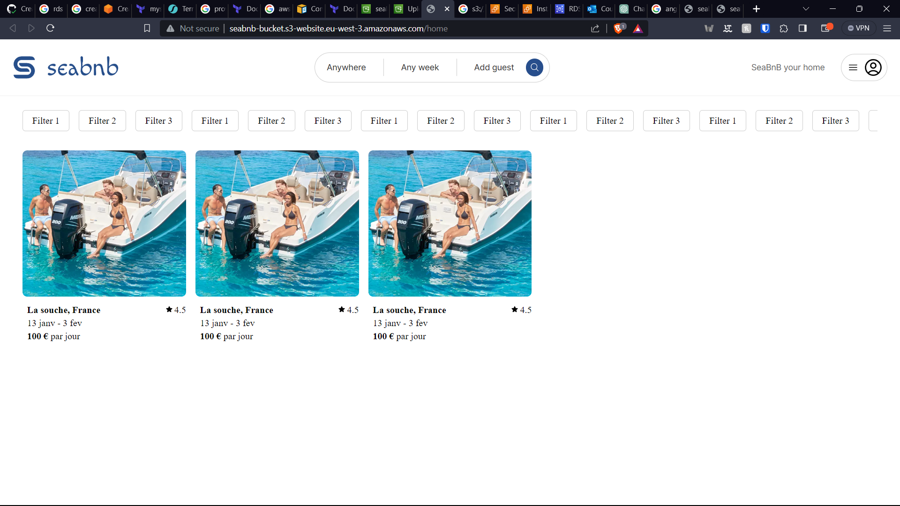
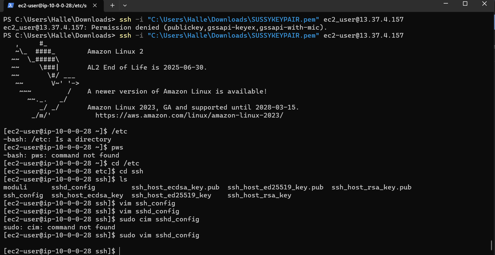
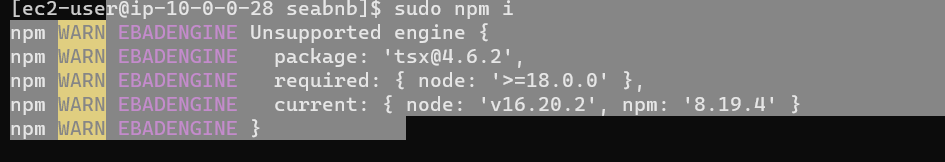
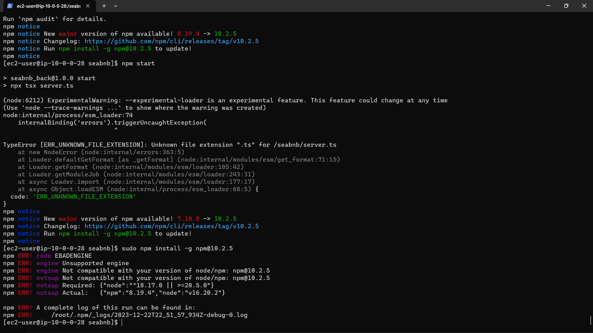

HI,
so most of the project is done with terraform but some parts might be made 
in the AWS console. So do not be suprised if everything is not there after running terraform apply.

The bucket where the angular app is defined is not in the terraform code, 
here is the link to the bucket:
http://seabnb-bucket.s3-website.eu-west-3.amazonaws.com/home

we have connected to the bastion with the command:
PS C:\Users\Halle\Downloads> ssh -i "C:\Users\Halle\Downloads\SUSSYKEYPAIR.pem" ec2-user@13.37.4.157
(as the subnet is public, we can connect to it directly)

cannot run node, backend cannot run so dead end
